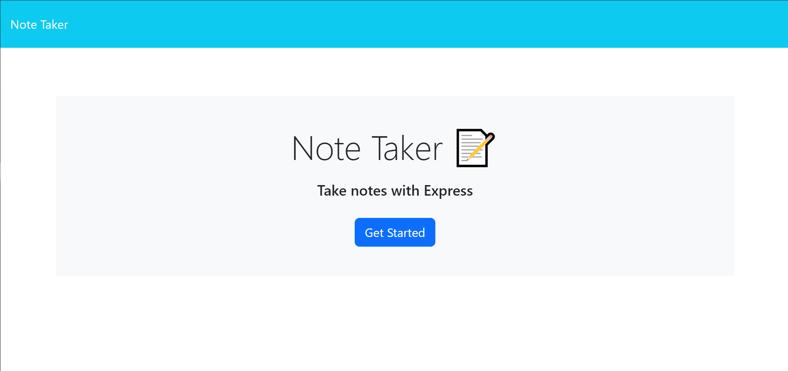
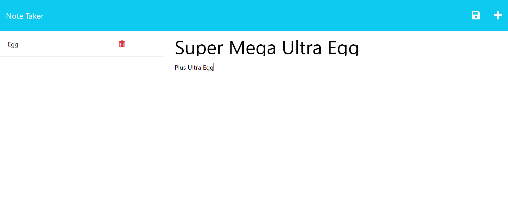
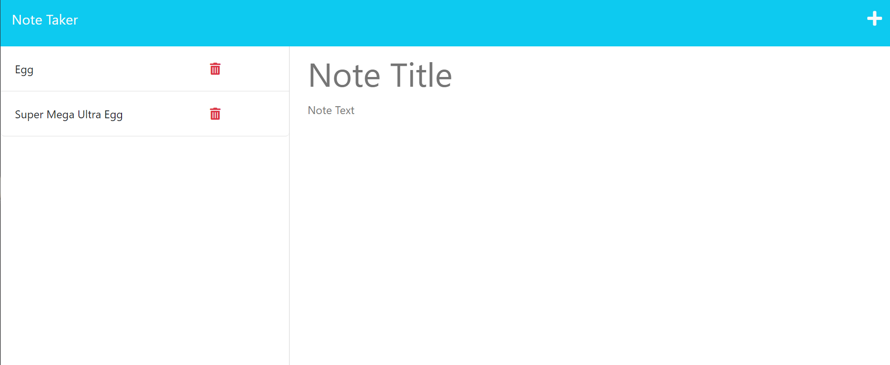
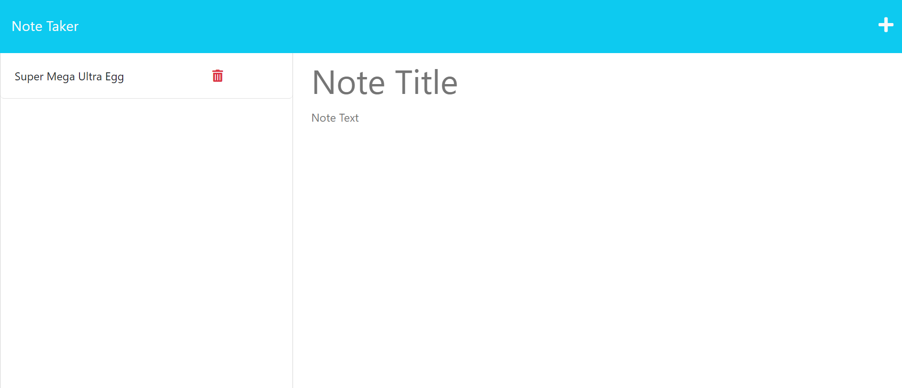

# Note-Taking-Helper
Module 11: Note Taker App

## Table of Contents:
- [Description](#Description)
- [Deployed URL](#Deployed-URL)
- [Installation](#Installation)
- [Screenshots](#Screenshots)
- [Contact](#Contact)

## Description
The goal of this application is to allow users to save and delete notes to keep their thought organized. This application uses express.js to GET, POST, and DELETE requests sent via the note taking app. To create a new note, first the user will need to press the `+` button on the top right of the page. The user then must first input information into both the heading and the body. The note can then be saved pressing the save button at the top right of the page(not the + icon). The button will appear once the user has enterd text for both the heading and the body. To delete a note, the user must press the trash can button on the left side of the page next to the correlating note. 

## Deployed URL
https://oops-all-notes.herokuapp.com/

## Installation

1. Clone the repository
2. Within the terminal, run `npm install` if the package.json file is present.
4. Start the server using `npm start`
5. Open your browser to the local server address

## Screenshots

Homepage

Writing Note 

Saving Note 

Deleting Note 

## Contact
[Terri Mack](https://github.com/terrinmack?tab=repositories)
